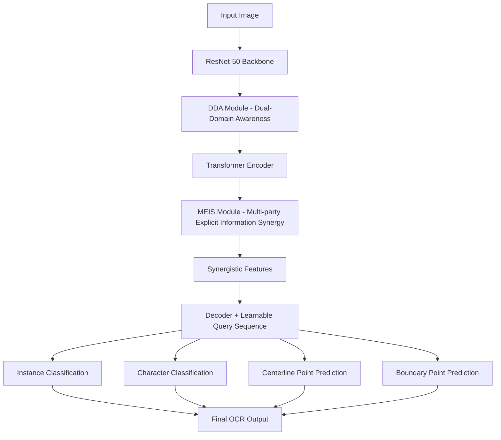

# MSIDA--OCR

A universal end-to-end  OCR framework that enhances text detection and recognition in complex real-world scenes. MSIDA integrates Dual-Domain Awareness (DDA) and Multi-party Explicit Information Synergy (MEIS) modules to improve recognition accuracy across diverse scripts, layouts, and orientations.

## Motivation

Traditional OCR methods perform well in single-language or scene-specific tasks but struggle with  recognition due to:

* Diverse text layouts and structures across languages
* Poor recognition of low-frequency characters in multi-script settings
* Difficulty handling curved, vertical, or long text in complex backgrounds

MSIDA addresses these challenges by synergizing detection and recognition features to improve end-to-end performance.

## Method



Key Components:

* DDA: Enhances spatial and directional features, strengthens text edges and regions
* MEIS: Aligns positional, categorical, and character-level information to improve detection and recognition synergy
* Decoder: Guides queries to jointly output detection and recognition results

## Results

MSIDA achieves state-of-the-art performance:

| Dataset    | Gain vs DeepSolo | Accuracy |
| ---------- | ---------------- | -------- |
| Total-Text | +0.8%            | 87.5%    |
| ICDAR 2015 | +0.8%            | 87.6%    |
| CTW1500    | +0.4%            | 64.6%    |

Strong performance on curved, multi-oriented, and long text
High parameter efficiency with only 40.9M parameters

## Installation

```bash
git clone https://github.com/yourname/MSIDA.git
cd MSIDA
conda create -n msida python=3.8 -y
conda activate msida
pip install -r requirements.txt
```

## Usage

Training:

```bash
python train.py --config configs/msida_totaltext.yaml
```

Evaluation:

```bash
python eval.py --config configs/msida_totaltext.yaml --checkpoint checkpoints/msida_best.pth
```

Demo:

```bash
python demo.py --image test.jpg --checkpoint checkpoints/msida_best.pth
```

